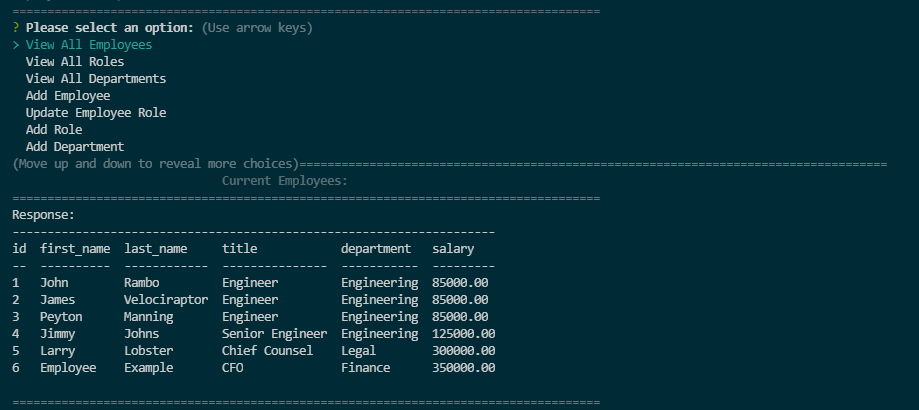

# Employee tracker

This application was built to develop and practice my skills with mySQL and Node. It is a command line application built to track employees, their roles, departments, salaries, and managers. 

## Screenshots

## Demo

## Link to Video

Link: (https://drive.google.com/file/d/105jmChb8C6Smh-xClhma72FLFVYgJMKn/view)

## Authors

- [@hamiltondowdy](https://www.github.com/hamiltondowdy)

## License

[MIT](https://choosealicense.com/licenses/mit/)

